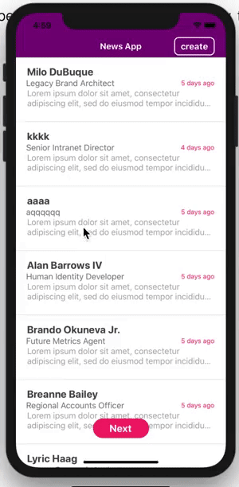

# News Demo



## Getting Started

1. [Fork repository](https://github.com/mosoakinyemu/newsdemo.git/fork) and clone it locally

```
$ git clone https://github.com/mosoakinyemi/newsdemo.git
$ cd newsdemo
$ yarn install
```

### Run on Android

```
$ npx react-native run-android
```

### Run on iOS

```
$ cd ios && pod install
$ cd .. && npx react-native run-ios
```
